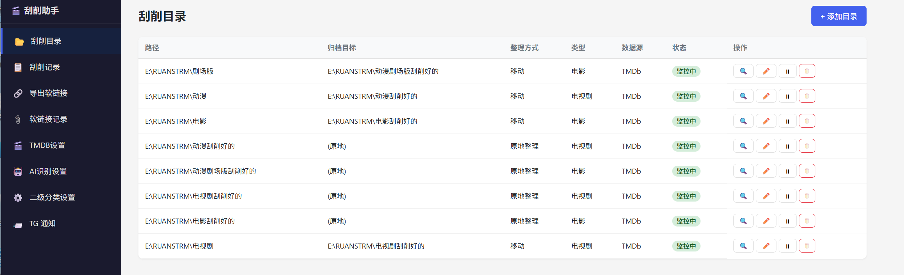
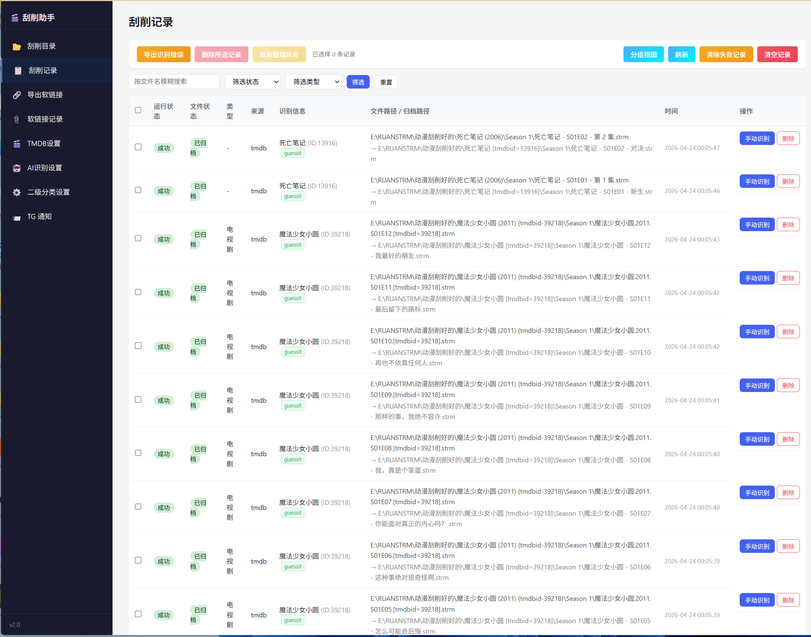
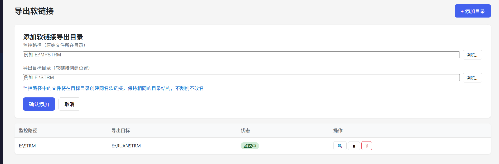
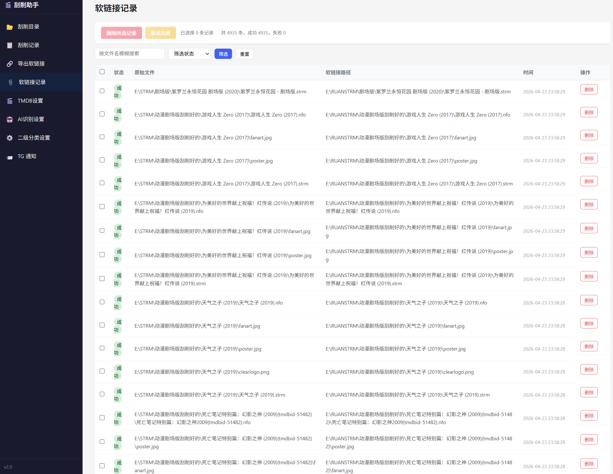
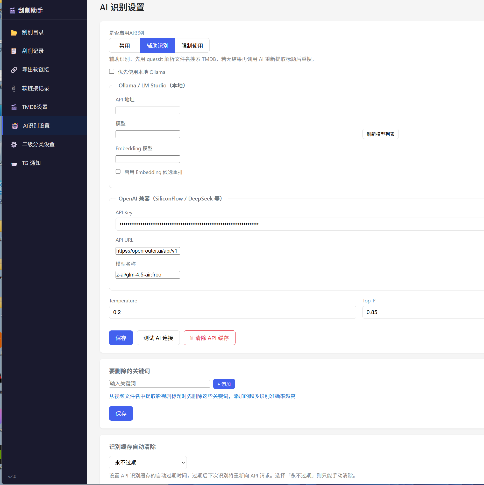
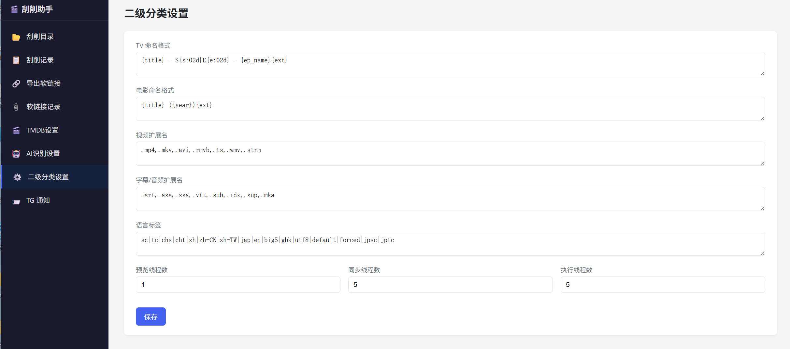
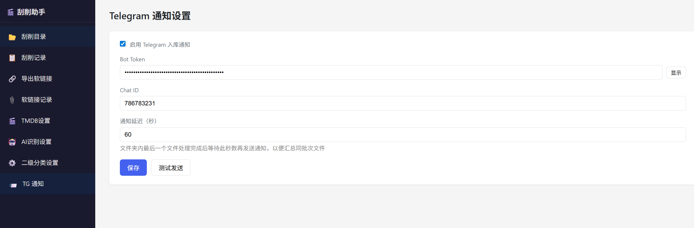
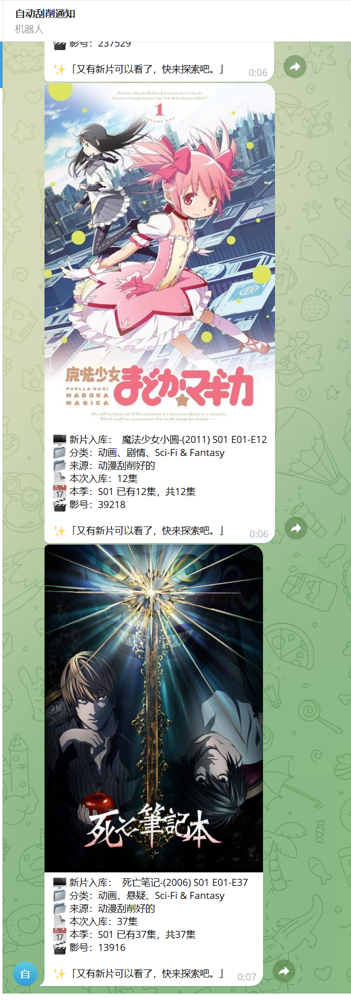

# 刮削助手

媒体文件自动归档与刮削工具，Web 管理界面版本。

TG 问题反馈群：<https://t.me/+Wx34NdYY_x1iNjg1>

支持监控多个源文件夹，AI 自动识别文件名，通过 TMDB / Bangumi 匹配元数据，将媒体文件归档到目标目录并生成 NFO + 海报封面，供 Kodi / Jellyfin / Emby 直接读取。AIkey如果不是收费的情况下，推荐是使用本地AI+Embedding 模型使用效果最佳！以免限速导致的识别问题！模型推荐qwen3.5 9B+nomic-embed-text或者 bge-m3 Embedding 模型！

<div align="center">

<p>
  <a href="#安装">安装</a> |
  <a href="#docker-部署">Docker 部署</a> |
  <a href="#运行">运行</a> |
  <a href="#界面预览">界面预览</a> |
  <a href="#功能概览">功能概览</a> |
  <a href="#配置说明">配置说明</a> |
  <a href="https://github.com/shai102/Scraping-Automation-Assistant/wiki/%E9%87%8D%E5%91%BD%E5%90%8D%E6%A8%A1%E6%9D%BF">命名模板</a>
</p>

</div>

## 项目亮点

| 模块 | 说明 |
|---|---|
| AI 识别 | 支持 OpenAI 兼容 API 与本地 Ollama；`辅助识别` 为 guessit + AI 混合模式，番组风格命名时会自动拉起 AI 修正标题/季集；测试连接时自动检测并显示深思模式状态 |
| 自动整理 | 支持移动、复制、软链接、硬链接、原地整理、导出软链接等多种落盘方式 |
| 元数据生成 | 自动写入 NFO，下载 poster、fanart、still，并补充演员、导演、类型等字段 |
| Web 管理 | 内置 FastAPI + Vue Web 界面，支持目录配置、记录查询、手动识别与实时推送 |
| 删除同步 | 监控源目录删除后，可同步清理导出软链接与后续刮削目标文件 |
| 通知与性能 | 支持 Telegram 聚合通知、Emby/Jellyfin 入库通知、分页分组视图、后台限速与批量处理防卡顿 |

## 适用场景

- 需要把下载目录自动整理成 Jellyfin / Emby / Kodi 可直接读取的媒体库。
- 想保留原文件不动，同时通过软链接或原地整理建立规范目录结构。
- 有大量番剧、字幕、`.strm`、附属音频文件，希望统一自动刮削与命名。
- 希望通过 Web 界面集中管理监控目录、失败记录、手动识别和通知配置。

## 首屏预览

<p align="center">
  <a href="./docs/1.png"></a>
</p>

## 界面预览

<table>
  <tr>
    <td width="50%" align="center">
      <a href="./docs/1.png"></a><br>
      主界面
    </td>
    <td width="50%" align="center">
      <a href="./docs/2.png"></a><br>
      高级设置与 API 配置
    </td>
  </tr>
  <tr>
    <td width="50%" align="center">
      <a href="./docs/3.png"></a><br>
      刮削目录配置
    </td>
    <td width="50%" align="center">
      <a href="./docs/4.png"></a><br>
      刮削记录
    </td>
  </tr>
  <tr>
    <td width="50%" align="center">
      <a href="./docs/5.png"></a><br>
      手动识别
    </td>
    <td width="50%" align="center">
      <a href="./docs/6.png"></a><br>
      导出软链接
    </td>
  </tr>
  <tr>
    <td width="50%" align="center">
      <a href="./docs/7.png"></a><br>
      软链接记录
    </td>
    <td width="50%" align="center">
      <a href="./docs/8.png"></a><br>
      TMDB / AI / 分类 / TG 通知
    </td>
  </tr>
</table>

## 功能概览

- **文件夹监控**：可添加多个监控目录，watchdog 实时检测新文件并自动入队。
- **多种整理方式**：移动、复制、软链接、硬链接、原地整理（rename）五种刮削模式可选。
- **原地整理保留目录**：`rename` 模式新增“已是媒体库结构时保留现有作品目录”开关；当当前目录已经是带 `tmdb` / `tmdbid` 标记的作品目录，且季层级、作品 ID 与识别结果一致时，只在当前目录内重命名文件并补写 NFO / 图片，不再强制新建新的 `tmdbid=` 父目录，可兼容旧式 `tmdb-`、`tmdbid-` 目录。
- **导出软链接**：独立侧栏页面配置，将监控目录内**所有文件**（视频、NFO、海报、字幕、.strm 等）软链接到目标目录，不刮削不改名；Windows 下 symlink 权限不足时自动 fallback 为复制。配合原地整理监控建立有序媒体库结构，原始文件不动。
- **删除同步**：在监控目录删除文件或文件夹时，自动同步删除导出目标目录中对应的软链接/复制文件及刮削整理后的目标文件（支持两跳链路：软链接目录 → 刮削整理目录），并递归清理空目录。DB 记录被清空时仍可通过 `target_root + 相对路径` 对第一跳进行兜底删除；各整理模式（copy / symlink / hardlink）同样支持删除同步，move / rename 模式不受影响。
- **软链接记录**：独立侧栏页面查看所有软链接操作记录（成功/失败），支持清除失败记录、清空全部，与刮削记录完全分离。
- **AI 识别**：支持 OpenAI 兼容 API（SiliconFlow / DeepSeek / OpenAI 等）与本地 Ollama。AI 模式分为禁用 / 辅助识别 / 强制使用；其中“辅助识别”已改为混合识别，标准命名优先使用 `guessit`，番组命名、标题弱、季集不清晰时会自动调用 AI 参与修正，并在记录中标记为 `guessit` / `AI` / `混合`。
- **关键词过滤**：全局配置剔除关键词，在 AI/guessit 识别前自动过滤干扰字符串，提升匹配准确度。
- **数据库匹配**：支持 TMDb 与 Bangumi（BGM），embedding 候选重排可选。数据源选“AI + TMDb”时，若 TMDB 无结果则自动回退到 BGM 搜索；回退命中时封面/背景图仍优先从 TMDB 获取，集数元数据来自 BGM，适用于 TMDB 未收录的动画（如高达 SEED HD 重制版）。文件名不含年份时，自动向上查找父目录名提取年份（如 `幽游白书 (2023)/Season 1/xxx.mkv`），精准区分同名不同年的作品。BGM 集标题仅在 TMDB 本身无 plot 时才回退获取，防止同名不同年（如 1992/2023 幽游白书）互相污染集标题。
- **自动归档**：识别成功后根据整理方式归档文件，归档后清理空目录。
- **跳过已刮削**：监控目录可开启"跳过已刮削文件"选项。视频文件检测到同名 .nfo 时跳过；字幕/音频附属文件（.ass/.srt/.mka 等）则检测同目录是否存在 season.nfo 或任意剧集 .nfo，有则跳过，避免重复刮削。
- **元数据刮削**：自动生成 NFO，下载 poster / fanart / still，写入演员、导演、类型等完整字段。
- **手动识别**：所有记录均可发起手动识别，支持选择季/集偏移（TV）或直接匹配（电影），整理范围可选“仅此文件”或“目录内所有文件”；已归档文件会自动恢复到原始状态后重新整理。搜索候选后点击“选择”高亮卡片，底部出现“确认整理「标题」”绿色按钮，二次确认后才执行，防止误触。手动整理时自动清除该作品所有集数的旧缓存，确保集标题、集简介等元数据全部重新从 TMDB 拉取，不受之前错误识别结果污染；目录模式下批量整理时，若兄弟文件已由上一轮正确整理到位，自动识别并更新 NFO 和数据库状态，不会误报“目标文件已存在”；`rename` 模式默认仍可生成规范父目录，若开启“保留现有作品目录”则会优先沿用当前已就位的媒体库目录。
- **字幕/音频识别**：字幕（.ass/.srt 等）和音频附属文件（.mka）进入监控流程时，优先读取同目录的 tvshow.nfo 取得已有 TMDB ID 直接获取剧集元数据（NFO 快速路径），无需重新发起识别；若无 tvshow.nfo，则通过向上追溯剧名目录（如 `镜像 (2006)/Season 2/xxx.chs.ass` 取祖父目录名"镜像"）发起搜索，大幅减少字幕文件进入"待手动"的情况。
- **刮削记录详情**：识别信息列对跳过/失败/待手动记录直接显示原因文字，无需逐条查看详情；并新增识别来源标签与筛选，可按 `guessit` / `AI` / `混合` 快速过滤，待手动记录同样会保留识别来源。
- **分组视图**：刮削记录支持按源目录分组显示，组内懒加载 + 分页，千集长番也不卡顿；可一键删除整组记录。
- **缓存管理**：API 查询缓存支持自定义过期天数（1 ~ 365 天或永不过期）。
- **Web 管理界面**：侧边栏导航覆盖刮削目录、刮削记录、导出软链接、软链接记录、TMDB、AI、分类、TG 通知等页面，配合 WebSocket 实时推送，无需手动刷新。
- **Telegram 通知**：归档完成后自动批量发送 TG 通知；按（监控目录 + TMDB ID + 季号）聚合，安静期（可配置，默认 5 分钟）内无新文件即触发发送，同一季多集批量入库只发一条通知；通知显示本次入库集数、本季 Season 目录已有集数及与 TMDB 总集数的缺集对比，方便直接判断是否有遗漏。
- **Emby / Jellyfin 入库通知**：新增独立设置页，可在刮削完成后按安静期合并触发一次媒体库扫描；支持测试连接、延迟配置与 API Key 鉴权，适合自动归档后立即让媒体服务器入库。
- **系统托盘**：后台运行，托盘图标右键可打开界面或退出。
- **CPU 限速**：后台处理线程数限制为 2，批量扫描时每个任务提交间隔 0.1s，避免大批量整理时 CPU 持续跑满。BGM API 同样加入令牌桶限速（5 req/s），防止"软件类"文件名触发模糊拆词回退时发出大量请求。
- **记录页面防卡顿**：刮削记录与软链接记录两个页面在批量处理期间，列表条目数始终保持在用户设置的每页数量（不随 WS 推送逐条增长）；新记录只更新总数计数，页面列表改为最后一条消息到来 3 秒后自动刷新一次，彻底避免高频渲染导致的卡顿。

## 项目结构

```text
main.py                         # 桌面壳入口：启动 uvicorn + 托盘图标
docker_main.py                  # Docker 入口：数据目录、日志初始化、服务启动
server.py                       # FastAPI 应用、lifespan、静态文件挂载

api/
  routes/                       # 只保留 HTTP / WebSocket 接口层
    logs.py
    monitor.py
    recognition_test.py
    records.py
    settings.py
    symlinks.py
    ws.py

ai/                             # AI 接口兼容层
  ollama_ai.py                  # 门面：兼容旧调用入口
  openai_compat.py              # OpenAI 兼容请求与连通性测试
  siliconflow_service.py        # 在线模型调用实现

core/
  logging/                      # 日志读取、解析、中文注释
    reader.py
    annotation.py
    annotation_*.py
  metadata/                     # 元数据完整性、NFO/图片 sidecar 更新
    completeness.py
    sidecar_service.py
    sidecar_update_service.py
  models/
    media_item.py
  recognition/                  # 识别预览、识别实验、候选测试链路
    preview_*.py
    test_service.py
  records/                      # 刮削记录查询 / 删除 / 手动处理
    query_service.py
    manual_service.py
    delete_service.py
  services/                     # 匹配、命名、WorkerContext 及运行时 mixin
    db_match_service.py
    matcher_service.py
    naming_service.py
    naming_templates.py
    season_rules.py
    worker_context.py
    worker_context_*.py
  settings/                     # 配置保存、预览、连通性测试
    config_service.py
    connection_service.py
    preview_service.py
  symlinks/                     # 软链接记录查询与动作
    query_service.py
    action_service.py
  workers/                      # 识别执行与归档入口
    execution_runner.py
    task_runner.py

db/                             # 数据库、TMDB / BGM / hybrid 查询
  database.py
  scrape_models.py
  tmdb_api.py                   # 门面：聚合 tmdb_*.py / bgm_api.py
  tmdb_*.py
  bgm_api.py

monitor/                        # 监控、轮询扫描、删除同步、元数据巡检
  watcher.py                    # 门面：FolderWatcher 总协调
  watcher_lifecycle.py
  watcher_metadata.py
  scan_service.py
  file_processor*.py
  delete_sync*.py
  metadata_refresh*.py
  record_state.py

utils/                          # 真正通用的工具和兼容门面
  app_runtime.py
  cache.py                      # 门面：兼容旧缓存调用入口
  cache_*.py
  logging_setup.py              # 门面：兼容旧日志初始化入口
  logging_*.py
  proxy.py
  library_paths.py
  title_parsing.py              # 门面：兼容旧标题解析入口
  title_*.py
  query_planning.py
  episode_parsing.py
  telegram_notify.py            # 门面：兼容旧 TG 通知入口
  telegram_notify_*.py
  emby_notify.py
  helpers.py                    # 兼容导出层，避免旧调用断裂

web/
  dist/                         # 纯静态前端资源
    index.html                  # SPA 页面骨架
    app.js                      # Vue 启动壳
    app-data.js
    app-computed.js
    app-methods-*.js
    app-components-*.js
    style.css
    vue.global.prod.js
```

> 当前仓库已完成主要模块拆分：`api/routes` 保留接口层，业务逻辑下沉到 `core/*`、`monitor/*`、`db/*`、`utils/*`，前端也已从单文件拆成 `data / methods / components` 多脚本结构。

如需继续做模块拆分和维护规划，可参考：

- [模块拆分路线图](./docs/architecture-refactor-roadmap.md)

## 环境要求

- Python 3.10+

## 安装

```bash
pip install -r requirements.txt
```

或直接运行，自动安装后启动：

```bat
安装并启动.bat
```

## Docker 部署

适合希望长期后台运行、集中挂载媒体目录、统一持久化配置的场景。

### 1. 准备

- 已安装 Docker / Docker Compose
- 规划好宿主机上的媒体目录
- 确认 TMDB / BGM / AI 所需网络访问正常

### 2. 创建本地 compose

仓库提供 Docker 镜像构建所需文件：

- `Dockerfile`
- `docker_main.py`
- `requirements-docker.txt`

`docker-compose.yml` 建议作为本机部署配置保存，不提交到 Git。先在项目根目录创建：

```yaml
name: media-scraper

services:
  scraper:
    build:
      context: .
      dockerfile: Dockerfile
    image: media-scraper:latest
    container_name: media-scraper
    restart: unless-stopped

    ports:
      - "8090:8090"

    extra_hosts:
      - "host.docker.internal:host-gateway"

    environment:
      - DATA_DIR=/data
      - TZ=Asia/Shanghai
      - HTTP_PROXY=http://host.docker.internal:7890
      - HTTPS_PROXY=http://host.docker.internal:7890
      - NO_PROXY=localhost,127.0.0.1,::1,192.168.100.195,host.docker.internal

    volumes:
      - ./data:/data
      - /home/shai102/huahuo:/media:rw

    healthcheck:
      test: ["CMD", "python", "-c", "import urllib.request; urllib.request.urlopen('http://localhost:8090/api/settings')"]
      interval: 30s
      timeout: 10s
      retries: 3
      start_period: 15s
```

按自己的机器调整：

- `/home/shai102/huahuo:/media:rw`：宿主机媒体目录挂到容器内 `/media`
- `HTTP_PROXY` / `HTTPS_PROXY` / `NO_PROXY`：按实际代理地址修改；不需要代理时可以删除这几行和 `extra_hosts`
- `"8090:8090"`：左侧是宿主机访问端口，右侧是容器内服务端口

启动：

```bash
docker compose up -d --build
```

默认监听：

- `http://127.0.0.1:8090`

停止：

```bash
docker compose down
```

### 3. 持久化目录

容器内通过 `DATA_DIR=/data` 保存这些文件：

- `media_renamer.db`
- `renamer_config.json`
- `api_cache.json`
- `logs/app/YYYY-MM-DD.log`
- `logs/metadata/YYYY-MM-DD.log`
- `logs/scrape/YYYY-MM-DD.log`

上面的 compose 默认已挂载：

```yaml
volumes:
  - ./data:/data
```

这意味着：

- 重启容器后配置、数据库、缓存不会丢
- 不建议删除项目下的 `data/` 目录，除非你就是要清空程序数据

### 4. 媒体目录挂载

真正需要监控和整理的目录，要额外挂到容器里。

例如：

```yaml
volumes:
  - ./data:/data
  - /your/downloads:/downloads:rw
  - /your/media:/media:rw
```

然后在 Web 界面的“监控目录”配置页面中填写：

- 监控路径：`/downloads`
- 归档目标根目录：`/media`

注意，这里填写的是**容器内路径**，不是宿主机路径。

### 5. Windows / Docker Desktop 注意事项

如果你是在 Windows 上使用 Docker Desktop：

- Windows 宿主机写入文件时，容器内不一定能即时收到 watchdog 事件
- 程序不会漏文件，因为内置了 30 秒轮询兜底
- 但实时刮削仍可能有几十秒延迟

如果你追求真正实时，建议：

- 直接在 Windows 本机运行 Python / EXE 版
- 或在标准 Linux 宿主机上运行 Docker

### 6. 硬链接模式注意事项

`hardlink` 模式要求：

- 源目录和目标目录必须在同一文件系统

如果你把两个路径挂成两个独立 volume，可能会报：

- `EXDEV: cross-device link not permitted`

推荐把它们挂到同一个宿主机根路径下，例如：

```yaml
volumes:
  - /your/disk:/disk:rw
```

然后在程序里配置：

- 监控路径：`/disk/downloads`
- 归档目标根目录：`/disk/media`

## 运行

```bash
python main.py
```

启动后自动在浏览器打开 `http://127.0.0.1:8090`，同时在系统托盘显示图标。

也可以单独启动 Web 服务（不带托盘）：

```bash
python -m uvicorn server:app --host 0.0.0.0 --port 8090
```

Docker 方式运行时，直接访问：

```text
http://127.0.0.1:8090
```

## 打包为 EXE

```bat
一键打包.bat
```

生成 `dist/刮削助手.exe`，单文件可执行，包含所有静态资源。EXE 图标与系统托盘图标一致（蓝色圆形图标）。

> 首次打包前需确保项目目录下已生成 `app.ico`，可单独运行：
> ```python
> python -c "
> from PIL import Image, ImageDraw
> size=256; img=Image.new('RGBA',(size,size),(0,0,0,0)); draw=ImageDraw.Draw(img)
> draw.ellipse([2,2,253,253],fill='#4361ee'); draw.ellipse([72,72,183,183],fill='#ffffff'); draw.ellipse([112,112,143,143],fill='#4361ee')
> img.save('app.ico',format='ICO',sizes=[(16,16),(24,24),(32,32),(48,48),(64,64),(128,128),(256,256)])
> "
> ```

## 配置说明

在 Web 界面的设置页中配置，所有设置保存在 `renamer_config.json`：

| 设置项 | 说明 |
|---|---|
| TMDb API Key | 从 themoviedb.org 获取 |
| BGM API Key | 可选，用于 Bangumi 查询 |
| Ollama API 地址 / 模型 | 本地大模型识别 |
| OpenAI 兼容 API Key / URL / 模型 | SiliconFlow / DeepSeek 等，测试连接时会显示深思模式状态 |
| Temperature / Top-P | AI 推理参数，默认 0.20 / 0.85 |
| TV / 电影命名格式 | 支持 `{title}`, `{year}`, `{s:02d}`, `{e:02d}` 等占位符 |
| 预览/同步/执行线程数 | 各阶段并发数 |
| 剔除关键词 | AI 识别前自动移除的干扰字符串（全局） |
| 缓存过期天数 | API 查询缓存自动清理周期（0 = 永不过期） |
| Telegram Bot Token / Chat ID | 归档完成后发送 TG 通知 |

> Docker 模式下，这些配置同样写入 `DATA_DIR` 下的 `renamer_config.json`，不是写回镜像内部。

### 监控目录配置

| 字段 | 说明 |
|---|---|
| 监控路径 | 文件来源目录 |
| 归档目标根目录 | 归档后的目标路径（原地整理模式不需要） |
| 整理方式 | 移动 / 复制 / 软链接 / 硬链接 / 原地整理 |
| 媒体类型 | 自动判断 / 电影 / 电视剧 |
| 数据源 | AI + TMDb 或 AI + BGM |

> **导出软链接**目录在侧栏「导出软链接」页面单独管理（只需填监控路径 + 目标路径），不在「刮削目录」列表中显示。软链接操作记录独立保存在「软链接记录」页面，与刮削记录完全分离。
>
> Docker 模式下，这里的路径必须填写容器内路径，例如 `/downloads`、`/media`，不要直接填写宿主机的 `D:\下载`、`E:\媒体库`。

#### 导出软链接 + 原地整理拆分方案

适用场景：原始文件存放在一个目录（如 `E:\MPSTRM`），希望在另一个目录（如 `E:\STRM`）建立完整的媒体库结构供 Emby/Jellyfin 读取，同时不占用额外磁盘空间。

```
监控目录1： E:\MPSTRM（导出软链接模式，目标 = E:\STRM）
  ↓ 新文件到达 → 在 E:\STRM 创建同名软链接 → 完成（不刮削）

监控目录2： E:\STRM（原地整理模式）
  ↓ 检测到新软链接 → AI 识别 + 刮削 → 在 E:\STRM 内建立有序结构

结果： E:\MPSTRM\raw.mkv 不动
        E:\STRM\黑袍纠察队 (2019)\Season 5\黑袍纠察队 - S05E01.mkv → 软链接
```

## 日志

日志按天分文件保存在程序数据目录下：

- 普通日志：`logs/app/YYYY-MM-DD.log`
- 元数据巡检日志：`logs/metadata/YYYY-MM-DD.log`
- 刮削流程日志：`logs/scrape/YYYY-MM-DD.log`

Web 界面里也提供了：

- `刮削日志`
- `元数据日志`
- `普通日志`

两者都支持按日期查看、关键字筛选和中文注释说明。
